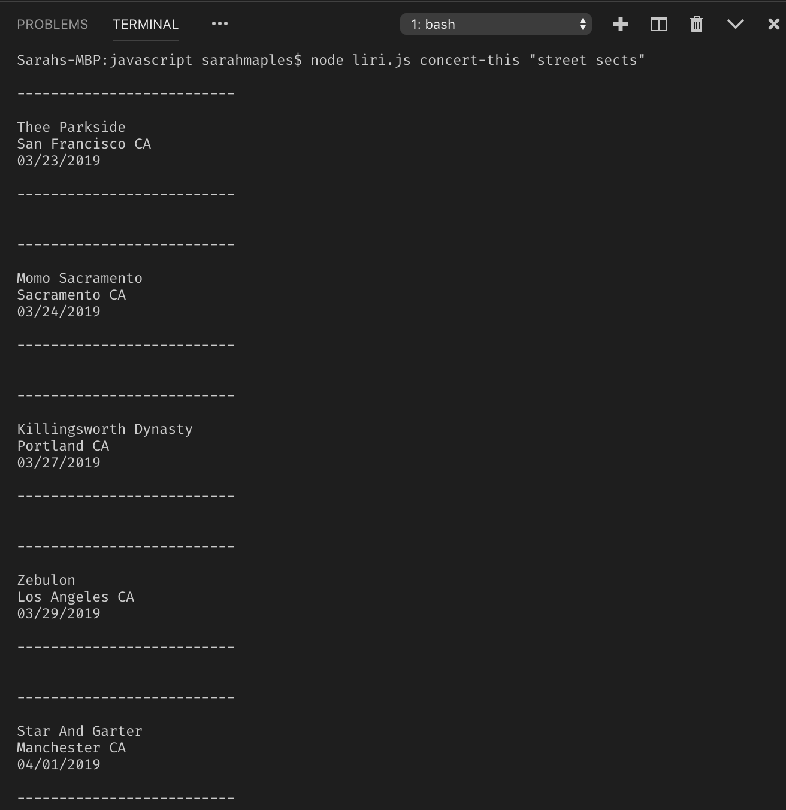
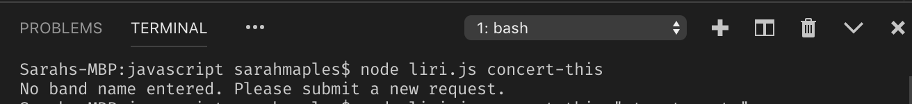
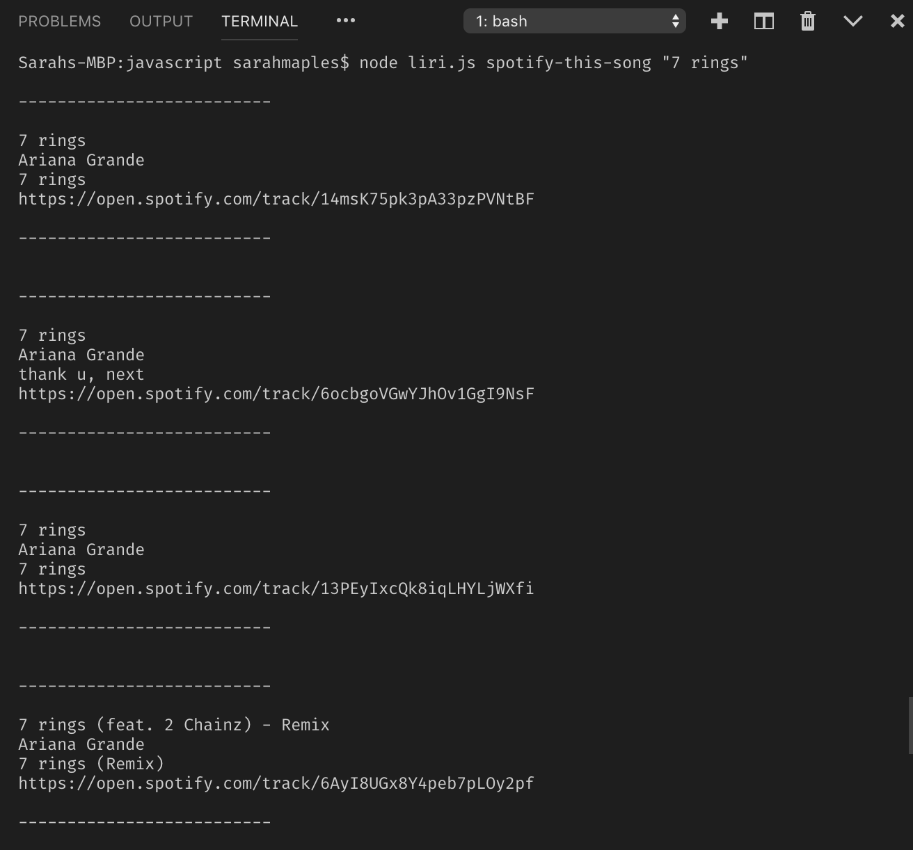
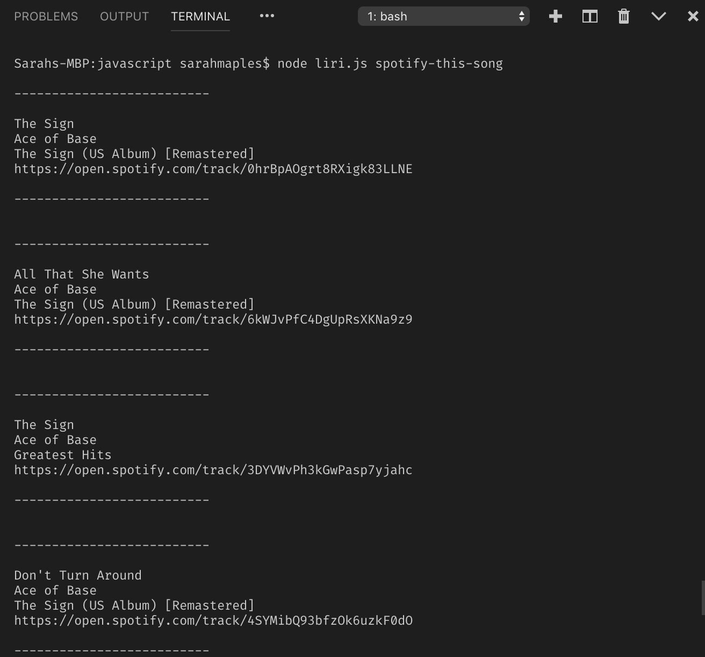
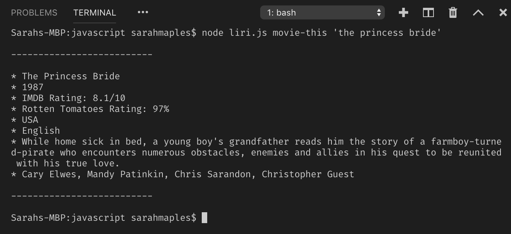
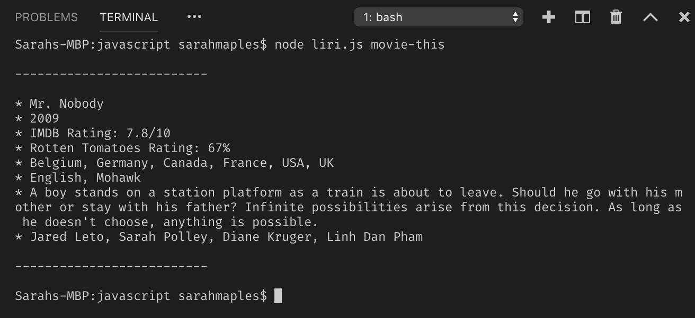
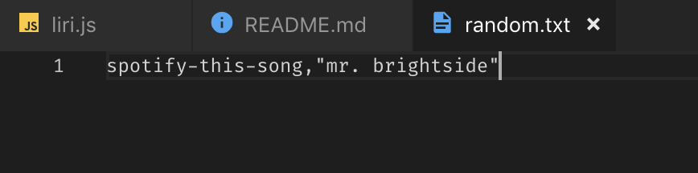
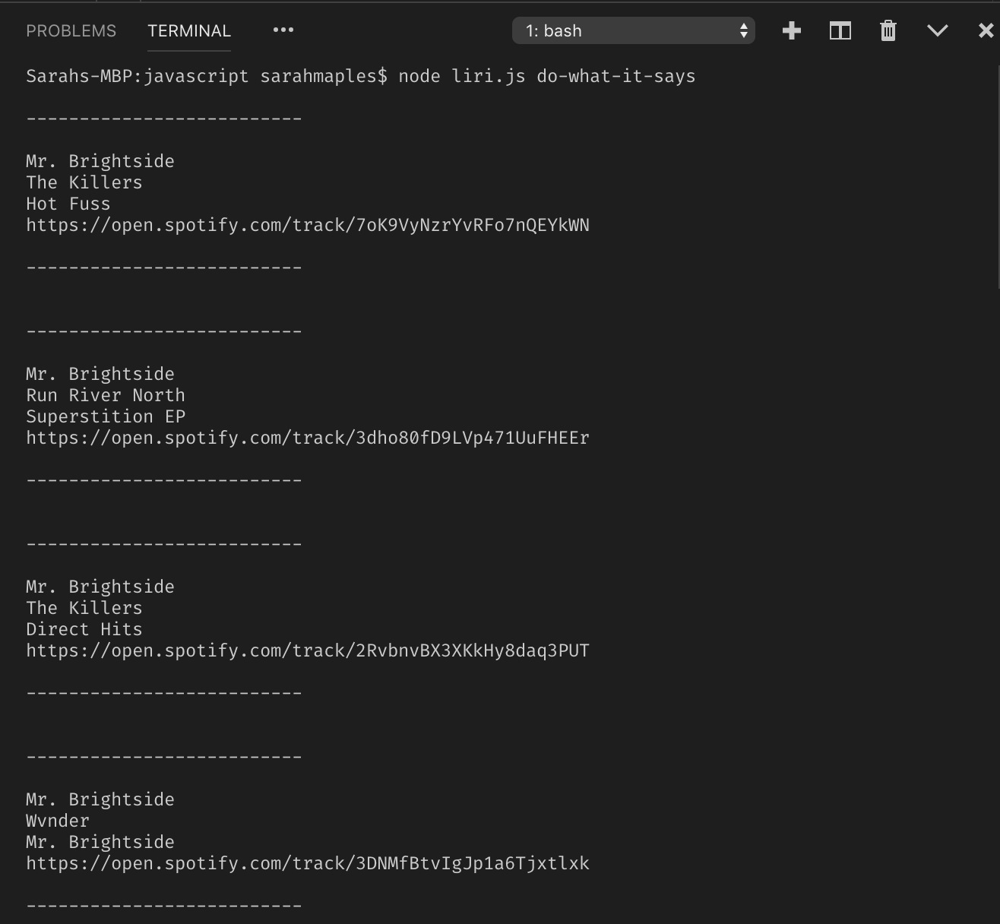

 # liri-node-app

### What Each Command Does

1. `node liri.js concert-this <artist/band name here>`

This searches the Bands in Town Artist Events API for the user specified artist and renders concert dates and location information for the upcoming months.

If no band name is entered, the program will prompt the user to submit  a new request.

2. `node liri.js spotify-this-song '<song name here>'`

This returns information for songs on Spotify matching the search term.

If no song is entered, or there are no results, the program default searches "The Sign" by Ace of Base.

3. `node liri.js movie-this '<movie name here>'`

This outputs relevant information about the movie entered.

If no movie is entered, the program default searches 'Mr. Nobody'.

4. `node liri.js do-what-it-says`

This command reads a random.txt file and executes the command specified.

### Demo Video: 

